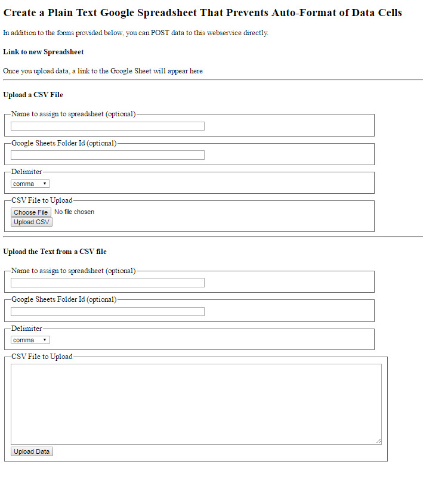

# PlainTextCSV_GoogleAppsScript
Create a Google Sheet from a CSV file preventing auto-formatting of date and number fields

By default, both Excel and Google Sheets auto-format date and numeric fields on import.  This can introduce errors in systems that expect these values to be retained as strings.

For example
`2016-04` is converted to a date `04/01/2016`

# Source Project - Clone It For Yourself
- [Google Script Project](https://script.google.com/a/georgetown.edu/d/13HcFhMle_oIBTfhuZEya_zQHAokJjgZEdqTEoOTeEfrpx5UpTmNUh_pB/edit?usp=drive_web)
  - Select "Make a Copy" to save an editable copy
  - Click "Deploy as Webapp", set the run as parameters as appropriate to you
  - Get the current web app URL
  - Run the Web App to upload a CSV file

## Sample Screenshots
### Web Service Landing Page

### Sample CSV Input

Note the date fields that should not be auto-formatted.

### Sample Generated Google Sheet

Note the preservation of the date strings in the resulting spreadsheet.

## Installation
* Open Google Drive
* Create a new "Google Apps Script" and name it "CSV Upload"
* Load the 3 code files in this repository
* Click the "Deploy as Web App" button (cloud with an arrow in it)
* Execute the app as: User Running the Script
* Who has access: Choose the appropriate audience
* Save the URL to the deployed application (be sure the URL ends with /exec and not /dev)
* Share the URL with your users
* Users will need to authorize the application to write to Google Drive before running the application

## StackOverflow Thread
http://stackoverflow.com/questions/36605298/create-a-google-sheet-with-plain-text-cells-to-prevent-auto-format-of-strings

***
[Georgetown University Library IT Code Repositories](http://georgetown-university-libraries.github.io/)

